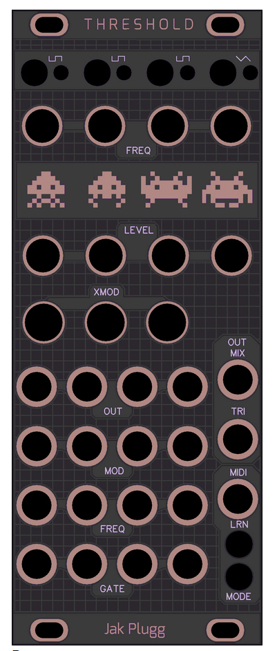

# Threshold
Threshold Is a variation of mutable instruments edges with the optional MIDI expander built in.

10Hp eurorack module.

Changes from stock + expander: 
* Smaller format.
* The MIDI 3.5 mm jack can take either polarity MIDI input cable.

[Google sheet BOM (in progress):](https://docs.google.com/spreadsheets/d/1nCMJflaLFtwUi6HDH4o52J6lPIyUTL-9VEssIF-3D1U/edit?usp=sharing)

JM.

